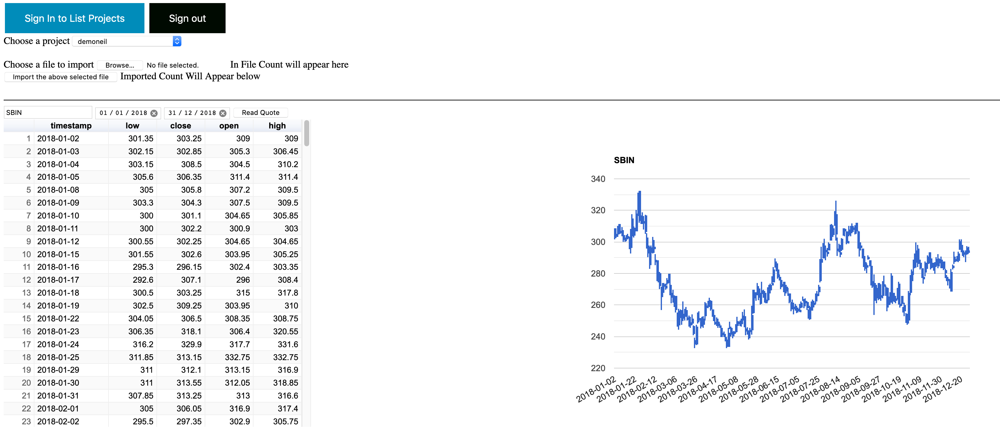

# gcloud-data-exchange

## Demonstration of 
* Google OAuth flow to grant permissions to google cloud resources (Cloud Platform Readonly and Datastore)
* Upload CSV file to populate datastore 
* Read datastore using dynamically formed GQL query

